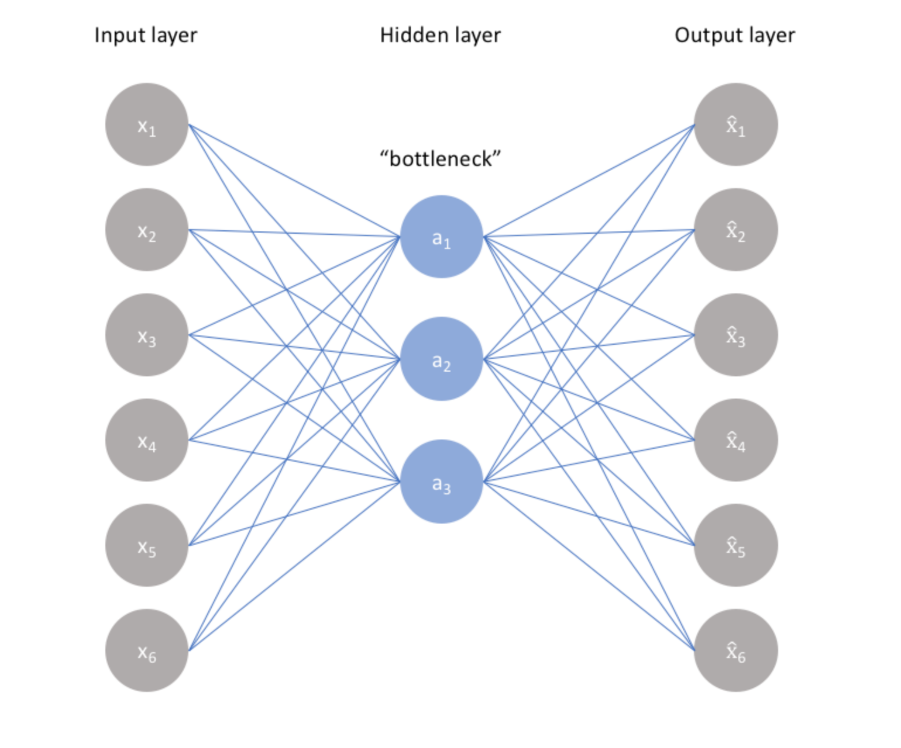
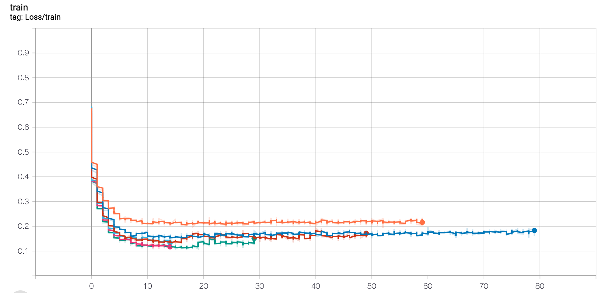
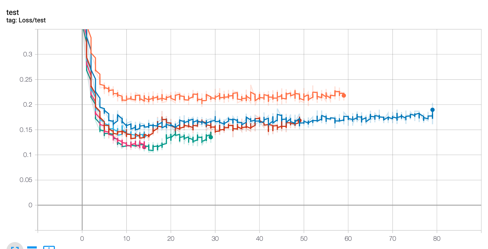

# Implementation of an naive autoencoder and use of Dataset and DataLoader classes in Pytorch.

In this practical work we implemented a naive autoencoder using a fully connected neural network.
We used the MNIST dataset and we wanted to reproduce an image that is as close as possible to the image at the input of our neural network.

MNIST data are handwritten numbers 28x28 pixels. We use only MLP network so we concatene our image to have an input vector of size **784**.
Our architecture is very simple :
* A simple layer to encode and another to decode our image. 
* ReLU activation between encode and decode part. Sigmoid activation for the output.
* We force our neural network to use the same weight for the encoder and the decoder to avoid over-fitting
* We use a Binary Cross Entropy Loss for our model
* Adam optimizer

An important parameters : the latent dimension of the representation of our image! 
If this dimension is to small the model will have difficulty to learn and converge and if its to big and close to the size of the input we lose the interest to use an autoencoder.

## Some results
### Loss functions:
Train:

Test:

### Comparison between the input and the output:

Latent dimension : 120.
